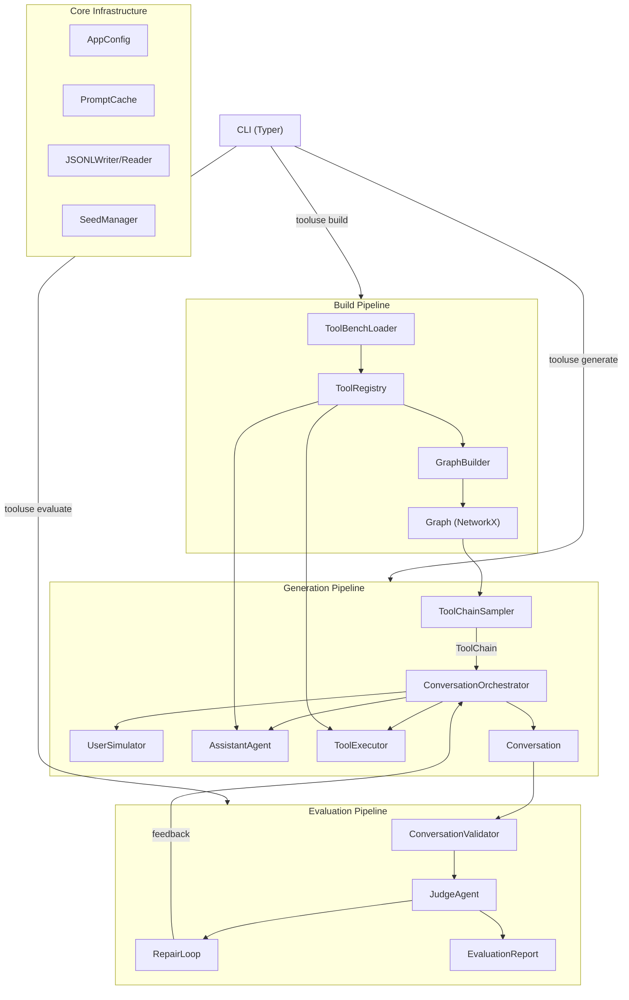
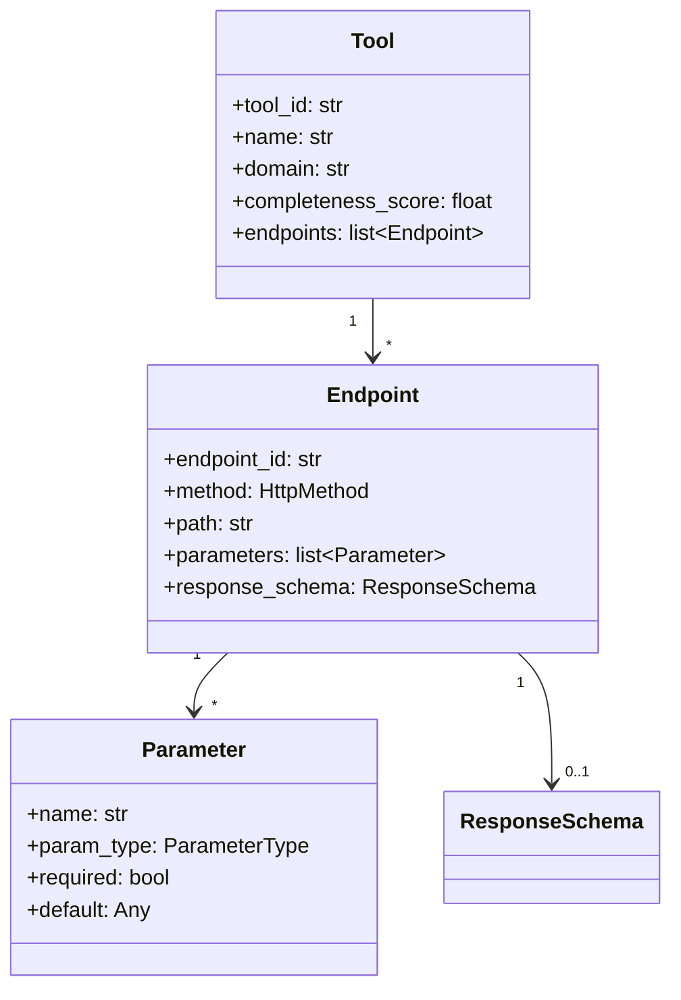
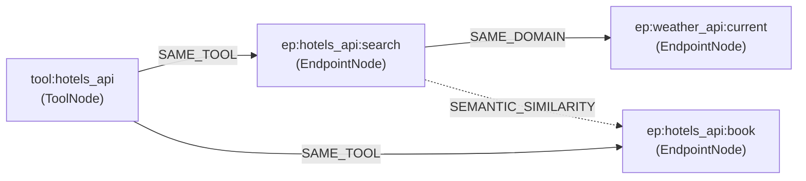
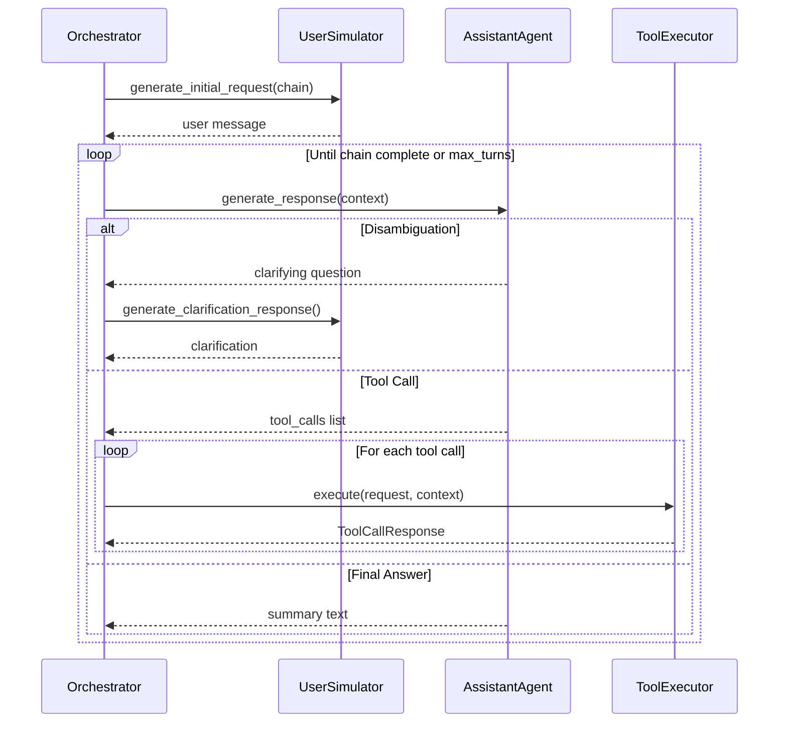
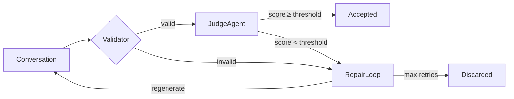

# DESIGN.md — tooluse-generator

> Architecture decisions, prompt design, context management, and diversity analysis.

---

## Table of Contents

1. [Architecture & Decisions](#1-architecture--decisions)
2. [Tool Registry Design](#2-tool-registry-design)
3. [Tool Graph + Sampler](#3-tool-graph--sampler)
4. [Offline Execution Model](#4-offline-execution-model)
5. [Multi-Agent System Design](#5-multi-agent-system-design)
6. [Quality Evaluation Pipeline](#6-quality-evaluation-pipeline)
7. [Context Management Design](#7-context-management-design)
8. [Prompt Design](#8-prompt-design)
9. [Diversity & Quality Analysis](#9-diversity--quality-analysis)

---

## 1. Architecture & Decisions

### System Overview



### Key Architectural Decisions

| # | Decision | Justification |
|---|----------|---------------|
| 1 | **Lenient ToolBench parsing** — handle 5 JSON formats, log warnings for malformed data | Maximises data ingestion; quality filtering happens later via `QualityTier` |
| 2 | **Two-level graph nodes** — `ToolNode` + `EndpointNode` | Enables both tool-level reasoning (domain edges) and endpoint-level chaining (parameter compatibility) |
| 3 | **MCTS for chain sampling** — UCB1 tree policy with reward shaping | Balances exploration vs exploitation; outperforms random walk for constraint satisfaction |
| 4 | **Offline-first agents** — all agents work with `llm_client=None` | Fast iteration and testing without API keys; LLM mode is opt-in |
| 5 | **Deterministic generation** — all randomness via `np.random.Generator` | Same seed produces identical output; enables reproducible experiments |
| 6 | **Validation-first evaluation** — structural checks before LLM scoring | Catches format errors cheaply; avoids wasting judge calls on broken conversations |
| 7 | **Repair via regeneration** — retry with feedback, not in-place patching | Simpler than turn-level editing; feedback in chain metadata guides the next attempt |
| 8 | **Pydantic v2 throughout** — all models use `BaseModel` with `ConfigDict` | Type safety, JSON serialization, validation, and computed fields in one framework |
| 9 | **NetworkX DiGraph** — tool graph stored as a directed graph | Mature library; supports PageRank, BFS, serialization; edges can be directional |
| 10 | **Diversity as sampling weight adjustment** — not post-hoc filtering | Steers generation toward underrepresented tools during sampling, not after |

### Technology Stack

| Component | Choice | Rationale |
|-----------|--------|-----------|
| Models | Pydantic v2 | Strict validation, `computed_field`, JSON serialization |
| CLI | Typer + Rich | Auto-generated help, rich tables/panels, progress bars |
| Graph | NetworkX | Mature graph algorithms (PageRank, BFS), pickle persistence |
| Embeddings | sentence-transformers (`all-MiniLM-L6-v2`) | Fast, 384-dim vectors, good semantic similarity |
| Progress | tqdm | Cross-platform, minimal overhead, disable-able |
| Config | YAML + Pydantic | Human-readable config files validated by typed models |
| Seeding | `numpy.random.Generator` | Modern API, reproducible, per-component isolation |

---

## 2. Tool Registry Design

### Data Model



### Format Handling

`ToolBenchLoader` (`registry/loader.py`) auto-detects and parses 5 JSON formats:

| Format | Detection | Example |
|--------|-----------|---------|
| `single_tool` | Top-level `api_list` key | Most RapidAPI tools |
| `tool_list` | Top-level array of tools | Bundled tool collections |
| `toolbench_v1` | Has `tool_name` + `api_list` | Standard ToolBench |
| `toolbench_v2` | Has `name` + `endpoints` array | Updated schema |
| `openapi` | Has `openapi` or `swagger` key | OpenAPI 3.x / Swagger |

**Design choice**: lenient mode (default) logs warnings and skips malformed entries. Strict mode raises on the first error. This maximises ingestion from the inconsistent ToolBench corpus.

### Normalization Pipeline

Raw JSON passes through four normalizers in `registry/normalizers.py`:

1. **TextNormalizer** — fix encoding, strip whitespace, normalise identifiers
2. **TypeNormalizer** — map string/int/bool/etc. to `ParameterType` enum
3. **PathNormalizer** — extract path parameters from `{id}`, `:id`, `<id>` syntax
4. **ValueNormalizer** — coerce defaults to correct Python types

### Quality Scoring

`CompletenessCalculator` scores tools on a 0–1 scale based on description quality, parameter documentation, and type annotations. Thresholds:

| Tier | Score | Usage |
|------|-------|-------|
| EXCELLENT | ≥ 0.8 | Preferred for sampling |
| GOOD | ≥ 0.6 | Default inclusion |
| FAIR | ≥ 0.4 | `build` command filter default |
| POOR | ≥ 0.2 | Excluded by default |
| MINIMAL | < 0.2 | Always excluded |

`RegistryBuilder` provides a fluent API:

```python
registry = (
    RegistryBuilder()
    .load_from_directory("data/toolenv/tools")
    .calculate_completeness()
    .filter_by_quality(QualityTier.FAIR)
    .build()
)
```

---

## 3. Tool Graph + Sampler

### Graph Schema

The tool graph is a NetworkX `DiGraph` with two node types and three edge types:



| Edge Type | Connects | Weight |
|-----------|----------|--------|
| `SAME_TOOL` | Tool → its endpoints | 1.0 (never pruned) |
| `SAME_DOMAIN` | Endpoints in same domain | Quality tier weight (0.1–0.9) |
| `SEMANTIC_SIMILARITY` | Endpoints with cosine > threshold | Cosine similarity score |

`GraphBuilder` (`graph/builder.py`) constructs the graph by adding tool nodes, endpoint nodes, domain edges, and semantic edges (via `EmbeddingService`). Edges are pruned to `max_edges_per_node=50` keeping highest-weight edges; `SAME_TOOL` edges are never pruned.

### MCTS Chain Sampling

`MCTSSampler` (`graph/sampler.py`) uses Monte Carlo Tree Search with UCB1 selection:

```
for iteration in range(max_iterations):
    node = SELECT(root)          # UCB1 tree policy
    child = EXPAND(node, graph)  # add one untried neighbour
    reward = ROLLOUT(child)      # random continuation up to rollout_depth
    BACKPROPAGATE(child, reward) # update visits + rewards to root
```

**Reward function** (per chain):

| Component | Weight | Condition |
|-----------|--------|-----------|
| Step-count bonus | +1.0 | `min_steps ≤ len ≤ max_steps` |
| Multi-tool bonus | +0.5 × n | Per unique tool ID |
| Domain bonus | +0.3 × n | Per unique domain |
| Edge coherence | +0.2 × n | Per consecutive pair with a graph edge |
| Constraint violation | −0.5 × n | Excluded tool used, required tool missing, out of range, too few tools |

**Fallback**: if MCTS exhausts `max_retries` (default 50), a weighted random walk is attempted. If that also fails, `SamplingError` is raised.

### SamplingConstraints

```python
class SamplingConstraints(BaseModel):
    min_steps: int = 2          # minimum endpoints in chain
    max_steps: int = 5          # maximum endpoints
    min_tools: int = 2          # minimum unique tools
    domains: list[str] | None   # restrict to these domains
    required_tools: list[str] | None
    excluded_tools: list[str] | None
    quality_threshold: str = "fair"
```

### Diversity-Aware Sampling

`DiversityTracker` (`graph/diversity.py`) tracks tool and domain usage across a batch. It provides inverse-frequency weights via `get_tool_weight(tool_id)` which decays as `1 / (1 + count × weight_decay)`. The `ToolChainSampler` facade integrates MCTS + pattern detection + diversity tracking in a single `sample_batch()` call. Steering is toggled via `--no-cross-conversation-steering`.

### Chain Patterns

Post-sampling, `PatternDetector` classifies chains:

| Pattern | Description |
|---------|-------------|
| `SEQUENTIAL` | Linear A → B → C (default) |
| `PARALLEL` | Independent steps grouped as `ParallelGroup` |
| `BRANCH_AND_MERGE` | Search → multiple options → single use |
| `ITERATIVE` | Same endpoint repeated (pagination, retry) |

---

## 4. Offline Execution Model

### Value Generation

`ValuePool` (`agents/value_generator.py`) maintains pre-built pools of realistic values by type: city names, hotel names, person names, prices, dates, IDs, URLs, emails, phone numbers, status values, etc. All randomness flows through `np.random.Generator` for determinism.

`SchemaBasedGenerator` infers response structure from endpoint metadata:

| HTTP Method | Path Pattern | Response Structure |
|-------------|-------------|-------------------|
| GET | Plural path (`/hotels`) | List of 2–5 objects with IDs |
| GET | Singular/parameterised | Single object with ID |
| POST | Any | Object with generated ID + status |
| DELETE | Any | Status confirmation |

### Argument Generation

`ArgumentGenerator` (`agents/argument_generator.py`) fills tool call arguments in priority order:

1. **Grounding resolution** — fuzzy-match parameter names against `ConversationContext.grounding_values` from prior tool outputs
2. **Enum/default fallback** — use parameter's enum values or default
3. **Fresh generation** — sample from `ValuePool` based on parameter type and name heuristics

### Grounding Tracking

`GroundingTracker` (`agents/grounding.py`) records the provenance of every extracted value: source endpoint, step index, and field name. `format_available_values(context, tracker)` produces a prompt fragment:

```
Available values from prior tool calls:
- hotel_id: htl_881 (from hotels/search, step 1)
- booking_id: bk_3391 (from hotels/book, step 2)
```

This ensures later tool calls reference real values from earlier outputs — not hallucinated placeholders.

---

## 5. Multi-Agent System Design

### Agent Roles

| Agent | Class | Responsibility |
|-------|-------|---------------|
| **User Simulator** | `UserSimulator` | Generates initial requests, follow-ups, clarification responses |
| **Assistant** | `AssistantAgent` | Selects tools from chain, generates disambiguation questions, final answers |
| **Tool Executor** | `ToolExecutor` | Mock-executes tool calls, extracts grounding values |
| **Judge** | `JudgeAgent` | Scores conversations on 4 quality dimensions |

All agents accept `llm_client=None` for offline (template-based) mode or an OpenAI-compatible client for LLM mode.

### Communication Protocol

`ConversationOrchestrator` (`agents/orchestrator.py`) drives a synchronous loop:



### State Machine

`ConversationStateMachine` (`agents/state_machine.py`) enforces valid transitions:

| State | Valid Events | Next State |
|-------|-------------|------------|
| `INIT` | `start` | `USER_TURN` |
| `USER_TURN` | `user_message` | `ASSISTANT_TURN` |
| `ASSISTANT_TURN` | `assistant_tool_call` | `TOOL_EXECUTION` |
| `ASSISTANT_TURN` | `assistant_disambiguate` | `DISAMBIGUATION` |
| `ASSISTANT_TURN` | `assistant_final` | `COMPLETE` |
| `TOOL_EXECUTION` | `tool_result` | `ASSISTANT_TURN` |
| `DISAMBIGUATION` | `user_clarification` | `ASSISTANT_TURN` |
| Any | `max_turns_reached`, `error` | `COMPLETE` / `FAILED` |

### Shared State

`ConversationContext` (`agents/execution_models.py`) holds all shared state: messages, tool outputs, grounding values, the driving `ToolChain`, current step index, and metadata. All agents read from and write to the context — the orchestrator mediates access.

---

## 6. Quality Evaluation Pipeline

### Pipeline Flow



### Structural Validation

`ConversationValidator` (`evaluation/validator.py`) runs 5 checks:

| Check | What It Validates |
|-------|-------------------|
| `_check_message_structure` | Roles alternate correctly, no empty messages |
| `_check_tool_call_validity` | Endpoint IDs exist in registry, required params present |
| `_check_grounding_consistency` | IDs in step N exist in outputs from step N−1 |
| `_check_minimum_requirements` | At least 1 tool call per conversation |
| `_check_conversation_completeness` | Starts with user, ends with assistant, not truncated |

### Judge Agent

`JudgeAgent` (`evaluation/judge.py`) scores on 4 dimensions (1–5 integer scale):

| Dimension | 1 (worst) | 5 (best) |
|-----------|-----------|----------|
| **tool_correctness** | Completely wrong tools | Perfect tool selection |
| **argument_grounding** | Hallucinated arguments | All arguments grounded in prior outputs |
| **task_completion** | Goal not addressed | Fully completed |
| **naturalness** | Robotic/incoherent | Indistinguishable from real conversation |

**Offline heuristic** (`_score_offline`): base scores + bonuses for tool call count, grounded value matches, message structure, and disambiguation presence. **LLM mode** (`_score_with_llm`): sends the conversation to GPT-4o with a rubric prompt, parses structured JSON scores.

### Repair Loop

`RepairLoop` (`evaluation/repair.py`) implements retry-with-feedback:

1. **Validate** — if structural issues, regenerate with validation errors as feedback
2. **Score** — if quality below `min_score` (default 3.5), regenerate with judge reasoning as feedback
3. **Repeat** — up to `max_retries` (default 3) with incrementing seed
4. **Give up** — mark as failed with `"max_retries_exceeded"`

Feedback is stored in `chain.metadata["repair_feedback"]` so the orchestrator can incorporate it. `RepairStats` tracks attempts, success rate, and per-attempt-number pass distribution.

---

## 7. Context Management Design

*(To be filled in during Task 73.)*

---

## 8. Prompt Design

*(To be filled in during Task 73.)*

---

## 9. Diversity & Quality Analysis

*(To be filled in during Task 74.)*
